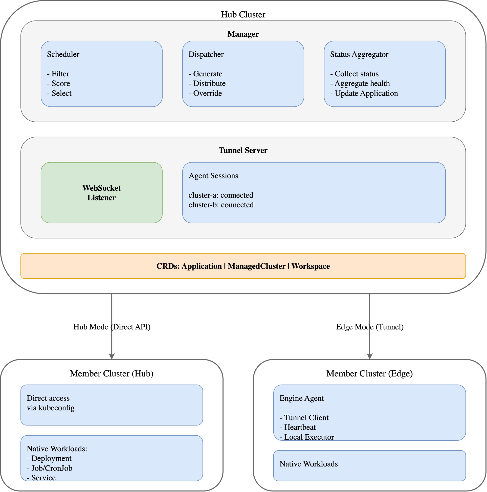

# Kumquat

[English](README.md)

Kumquat 是一个云原生多集群应用管理平台，旨在简化跨多个 Kubernetes 集群的应用分发、调度和管理。

## 特性

- **多集群管理**：从单一控制平面管理数十个 Kubernetes 集群
- **统一应用分发**：一次编写，到处部署，使用标准 K8s 工作负载
- **智能调度**：高级调度引擎，支持 Spread、BinPacking 和 Affinity 策略
- **双重连接模式**：同时支持 Hub（拉取）和 Edge（推送）集群连接方式
- **基于策略的覆盖**：无需复制 YAML 即可按集群自定义配置
- **全局状态聚合**：实时查看所有集群中的应用健康状态
- **可扩展的插件系统**：支持 MCS、监控和自定义扩展的插件架构
  - 内置 **Submariner Addon**：提供跨集群服务发现和网络互通能力
  - 支持多种网络模式：IPsec 隧道、WireGuard、VXLAN、扁平网络
  - 自动化 ServiceExport/ServiceImport 管理

## 架构

Kumquat 采用 Hub-Spoke 架构来高效管理多集群环境。



### 组件

| 组件 | 子项目 | 描述 |
|------|--------|------|
| **Manager** | Engine | 运行在 Hub 集群上的中央控制平面 |
| **调度器** | Engine | 基于插件的 Filter/Score 架构多集群调度引擎 |
| **Agent** | Engine | 运行在 Edge 集群上，维护隧道连接 |
| **隧道服务器** | Engine | 基于 WebSocket 的反向隧道，用于 Edge 集群连接 |
| **Portal** | Portal | 用户管理、认证授权 API |
| **Kumctl** | Kumctl | 命令行运维工具 |

### 连接模式

| 模式 | 方向 | 使用场景 |
|------|------|----------|
| **Hub** | Manager → 集群 | 可从 Hub 访问的集群（同一 VPC、VPN） |
| **Edge** | Agent → Manager | 位于 NAT/防火墙后的集群，无入站访问 |

## 子项目

| 目录 | 名称 | 说明 |
|------|------|------|
| [engine/](engine/) | Engine | 核心系统：多集群应用分发、调度和管理 |
| [armory/](armory/) | Armory | 基础 Docker 镜像构建（Alpine、Go、Node） |
| [portal/](portal/) | Portal | 应用层 API：用户管理、认证授权（待建） |
| [kumctl/](kumctl/) | Kumctl | 命令行工具（待建） |

## 快速开始

### 前提条件

- Go 1.22+
- Docker
- Kind（用于本地测试）
- kubectl

### 安装

```bash
# 克隆仓库
git clone https://github.com/fize/kumquat.git
cd kumquat

# 构建 engine 二进制文件
make -C engine build

# 构建基础镜像
make -C armory all
```

### 部署 Manager

```bash
# 安装 CRD 到集群
kubectl apply -f engine/config/crd/bases/

# 使用 Helm
helm install engine-manager charts/manager -n kumquat-system --create-namespace
```

### 注册集群（Hub 模式）

```yaml
apiVersion: storage.kumquat.io/v1alpha1
kind: ManagedCluster
metadata:
  name: production-east
  labels:
    env: production
    region: us-east
spec:
  connectionMode: Hub
  apiServer: https://prod-east.example.com:6443
  secretRef:
    name: prod-east-credentials
```

### 部署应用

```yaml
apiVersion: apps.kumquat.io/v1alpha1
kind: Application
metadata:
  name: nginx-app
  namespace: default
spec:
  replicas: 6
  workload:
    apiVersion: apps/v1
    kind: Deployment
    template:
      metadata:
        labels:
          app: nginx
      spec:
        containers:
        - name: nginx
          image: nginx:1.25
          resources:
            requests:
              cpu: 100m
              memory: 128Mi
  clusterAffinity:
    requiredDuringSchedulingIgnoredDuringExecution:
      nodeSelectorTerms:
      - matchExpressions:
        - key: env
          operator: In
          values: ["production"]
```

## 内置 Addon

### Submariner - 跨集群服务发现

Kumquat 内置 **Submariner Addon** (mcs-lighthouse)，提供跨集群服务发现和网络互通能力。

```yaml
apiVersion: storage.kumquat.io/v1alpha1
kind: ManagedCluster
metadata:
  name: cluster-1
spec:
  connectionMode: Hub
  apiServer: https://cluster-1.example.com:6443
  addons:
    - name: mcs-lighthouse
      enabled: true
```

网络模式：IPsec 隧道（默认）、扁平网络、VXLAN。

> **重要**：扁平网络模式需要用户自行配置底层网络路由。详见 [Addon 扩展设计](docs/zh/addon.md)。

## 文档

| 文档 | 描述 |
|------|------|
| [架构设计](docs/zh/architecture.md) | 系统整体架构和设计 |
| [调度器设计](docs/zh/scheduler.md) | 多集群调度框架 |
| [拓扑分布](docs/zh/topology_spread.md) | 跨区域/可用区工作负载分布 |
| [Edge 集群](docs/zh/edge.md) | 基于隧道的 Edge 集群管理 |
| [API 参考](docs/zh/api.md) | CRD 规范和示例 |
| [Addon 扩展设计](docs/zh/addon.md) | 插件架构和扩展机制 |

## 测试

```bash
# 单元测试
make -C engine test

# 使用 Kind 运行 E2E 测试
make -C engine e2e-kind
```

## 许可证

Apache License 2.0
