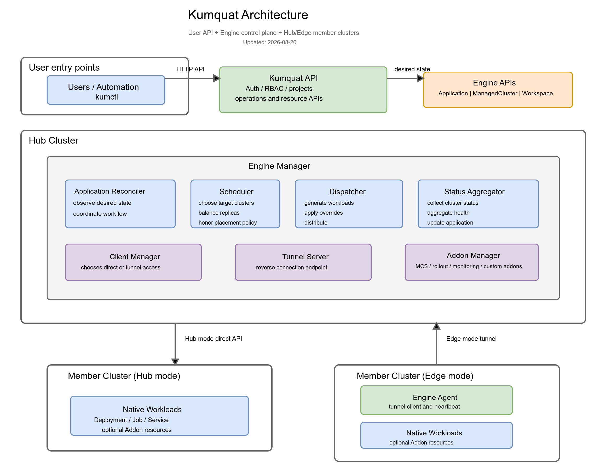
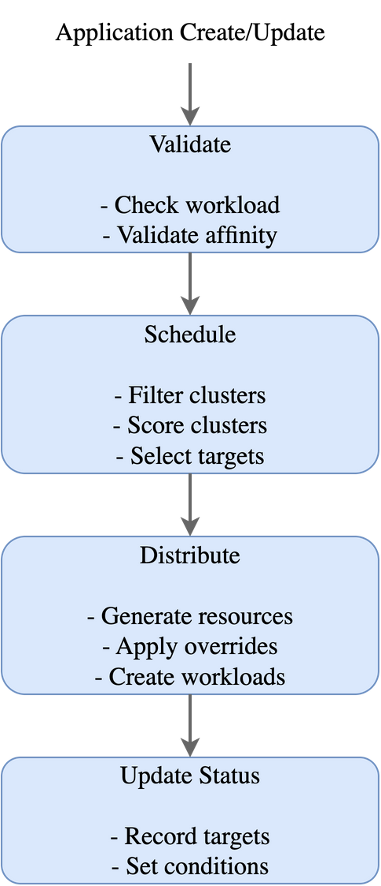
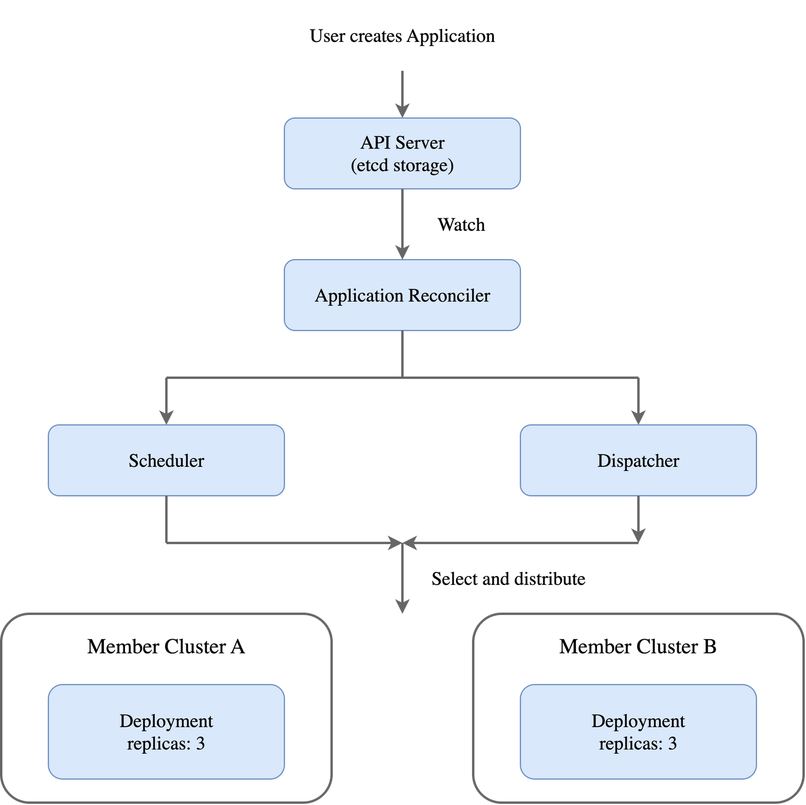
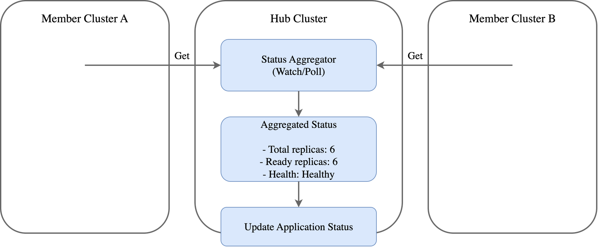

# Kumquat 架构设计

[English](../en/architecture.md)

## 概述

Kumquat 是一个云原生多集群应用管理平台，采用 **Hub-Spoke** 架构模型实现对多个 Kubernetes 集群的统一管理。本文档说明用户入口、API 层、Engine 控制平面和成员集群之间的职责边界。

## 架构总览



Kumquat 的结构分为四层：

| 层级 | 职责 |
|------|------|
| 用户入口 | 用户和自动化系统通过 `kumctl` 或 HTTP API 管理应用、集群、工作空间和项目资源 |
| Kumquat API | 负责认证授权、项目/模块组织、操作幂等和面向用户的资源接口 |
| Engine 控制平面 | 运行在 Hub 集群中，负责调度、分发、Addon 协调和状态聚合 |
| 成员集群 | 运行实际工作负载；Hub 模式由 Manager 直连，Edge 模式由 Agent 主动连接 Manager |

## 核心组件

### 1. Kumquat API

Kumquat API 是用户和自动化系统的统一入口。

**主要功能：**
- 管理用户、角色和访问权限
- 组织项目、模块和资源层级
- 接收应用、集群、工作空间等资源操作
- 为写操作提供幂等和操作状态查询
- 将用户意图投影到 Engine 可执行的资源模型

### 2. Engine Manager

Engine Manager 运行在 Hub 集群中，是多集群控制面的执行核心。

**主要功能：**
- 监听 Application、ManagedCluster、Workspace 等资源
- 协调应用调度、工作负载分发和状态聚合
- 管理 Addon 生命周期
- 为 Edge 集群提供反向隧道入口

### 3. 应用控制器 (ApplicationReconciler)

应用控制器是 Kumquat Engine 的核心组件，负责管理 Application 资源的完整生命周期。

**主要功能：**
- 监听 Application 资源的创建、更新和删除
- 调用调度器选择目标集群
- 调用分发器将工作负载部署到目标集群
- 协调状态聚合器更新应用状态

**处理流程：**



### 4. 调度器 (Scheduler)

调度器采用插件化架构，支持灵活的集群选择策略。

**调度阶段：**

| 阶段 | 描述 | 内置插件 |
|------|------|----------|
| **过滤 (Filter)** | 筛选满足条件的集群 | Health, Affinity, TaintToleration, Capacity, VolumeRestriction |
| **评分 (Score)** | 对候选集群打分 (0-100) | Affinity, Resource (LeastAllocated/MostAllocated), TopologySpread |
| **选择 (Select)** | 最终选择目标集群 | SingleCluster, Spread |

**内置插件详情：**

| 插件 | 阶段 | 功能 |
|------|------|------|
| Health | 过滤 | 排除不健康或离线的集群 |
| Affinity | 过滤/评分 | 根据亲和性规则筛选和评分 |
| TaintToleration | 过滤 | 处理集群污点和容忍 |
| Capacity | 过滤 | 检查集群资源容量是否满足需求 |
| VolumeRestriction | 过滤 | 检查集群是否支持所需的存储类型 |
| Resource | 评分 | 根据资源利用率评分 (支持 LeastAllocated/MostAllocated 策略) |
| TopologySpread | 评分 | 优先选择副本数较少的拓扑域 (可选，默认未启用) |

### 5. 客户端管理器 (ClientManager)

客户端管理器负责管理到所有成员集群的连接，根据集群的连接模式选择不同的访问方式。

**Hub 模式连接：**

```
Manager ──────────────────────────────► 成员集群 API Server
           HTTPS (kubeconfig/token)
```

Manager 通过 kubeconfig 或 ServiceAccount Token 直接访问集群的 API Server。

**Edge 模式连接：**

```
Manager ◄───────────────────────────── Agent
           WebSocket (隧道)
                │
                │ 请求通过隧道转发
                ▼
           成员集群 API Server
```

Agent 主动建立到 Manager 的 WebSocket 连接，Manager 的请求通过此隧道转发到集群。

### 6. 隧道服务器 (TunnelServer)

隧道服务器为 Edge 集群提供反向隧道连接能力。

**工作流程：**

1. **Agent 连接**：Agent 启动后主动连接 Manager 的 WebSocket 端点 (`/connect`)
2. **身份验证**：Manager 验证 Agent 的 Bootstrap Token 或 ServiceAccount Token
3. **维持心跳**：连接建立后，Agent 每 30 秒发送心跳
4. **请求转发**：Manager 需要访问 Edge 集群时，通过隧道转发请求

### 7. Agent

Agent 运行在 Edge 集群中，用于主动连接 Hub 侧 Manager。

**主要功能：**
- 建立并维护到 Manager 的隧道连接
- 上报集群心跳和基础状态
- 接收经过隧道转发的控制面请求
- 保证 Edge 集群无需暴露入站 Kubernetes API

### 8. Addon Manager

Addon Manager 负责为多集群场景安装和协调可选能力。

**内置能力：**
- MCS/Submariner 跨集群服务发现和网络互通
- Kruise Rollout 渐进式发布协调
- VictoriaMetrics 多集群监控集成
- 自定义 Addon 扩展点

### 9. 状态聚合器 (StatusReconciler)

状态聚合器负责收集各成员集群的工作负载状态，并聚合更新到 Application 资源。

**聚合逻辑：**
- 从每个目标集群收集工作负载状态（副本数、就绪数等）
- 汇总计算总体健康状态
- 更新 Application 的 status 字段

**健康状态：**

| 状态 | 描述 |
|------|------|
| Healthy | 所有集群中的工作负载都正常运行 |
| Progressing | 工作负载正在更新中 |
| Degraded | 部分或全部集群的工作负载异常 |

## 数据流

### 应用创建流程



1. 用户通过 `kumctl` 或 Kumquat API 创建应用。
2. API 完成认证授权、幂等校验和资源转换。
3. Engine 监听到应用期望状态后执行调度。
4. 分发器将工作负载下发到目标成员集群。
5. 状态聚合器收集成员集群结果并回写应用状态。

### 状态同步流程



## 连接模式对比

| 特性 | Hub 模式 | Edge 模式 |
|------|----------|-----------|
| **连接方向** | Manager → 集群 | Agent → Manager |
| **网络要求** | 集群 API Server 可从 Hub 访问 | Agent 可访问 Manager |
| **适用场景** | 同一 VPC、VPN 连通的集群 | NAT/防火墙后的集群 |
| **认证方式** | kubeconfig 或 ServiceAccount Token | Bootstrap Token 或 ServiceAccount Token |
| **是否需要 Agent** | 否 | 是 |
| **延迟** | 低 | 略高（隧道转发） |

## 高可用设计

### Manager 高可用

- 支持多副本部署
- 使用 Leader Election 确保只有一个活跃实例处理调度
- 客户端连接缓存和复用

### Agent 高可用

- 支持断线自动重连（指数退避策略）
- 心跳超时自动重建连接
- 本地工作负载不受隧道断开影响

## 相关文档

- [调度器设计](scheduler.md) - 详细的调度器架构和插件机制
- [拓扑分布指南](topology_spread.md) - 跨区域/可用区工作负载分布
- [Edge 集群管理](edge.md) - Edge 模式的详细配置和操作指南
- [API 参考](api.md) - CRD 规范和示例
